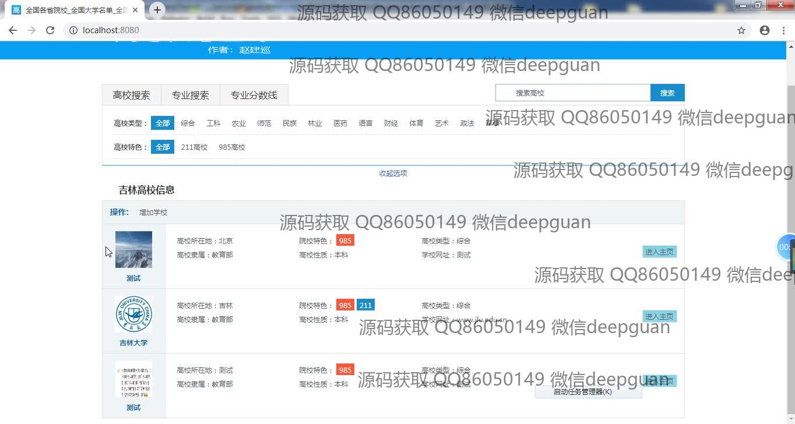
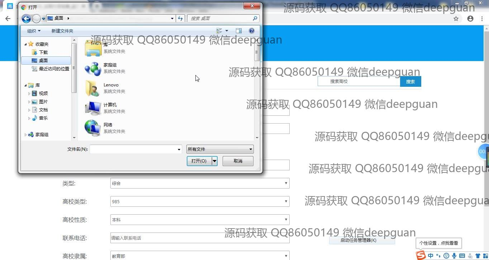
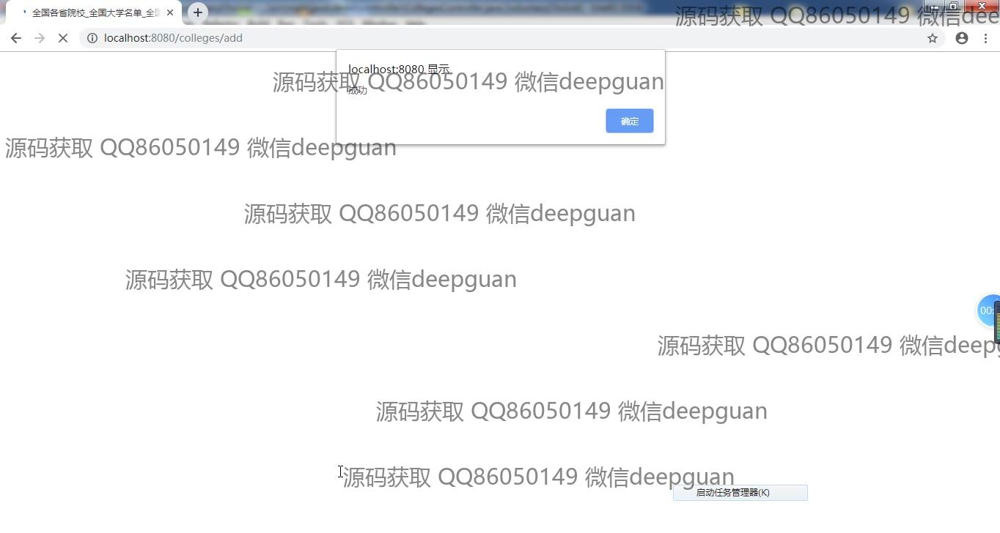
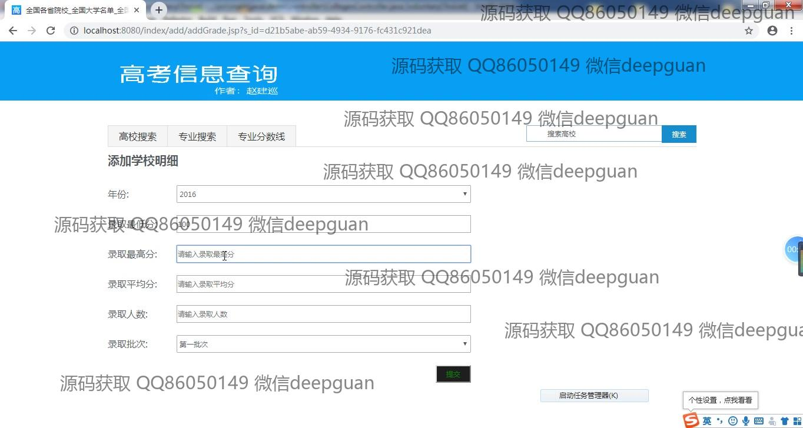
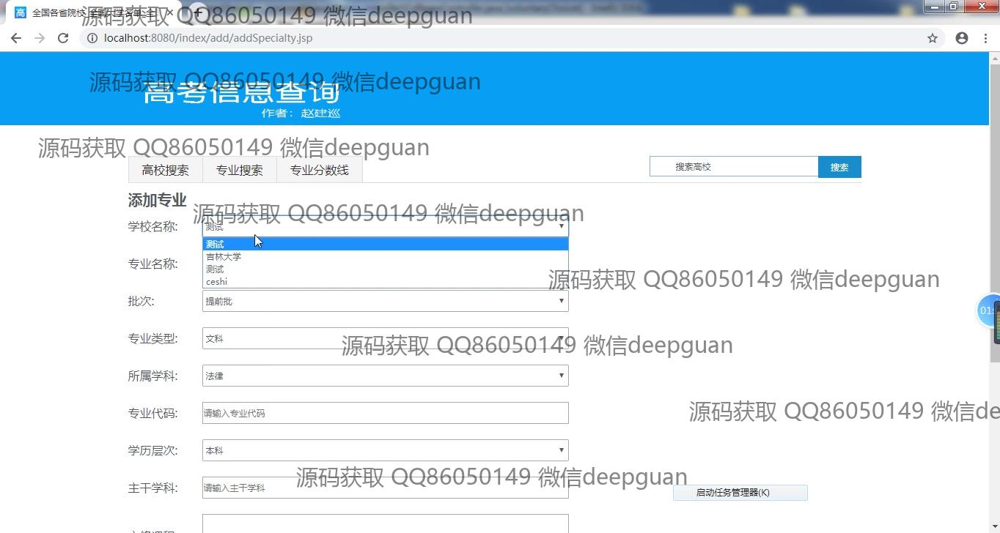
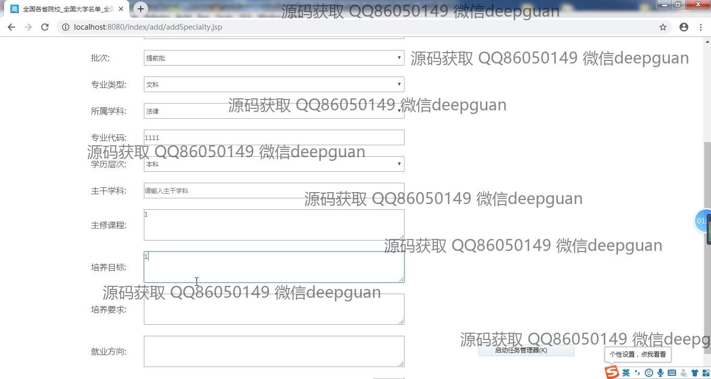
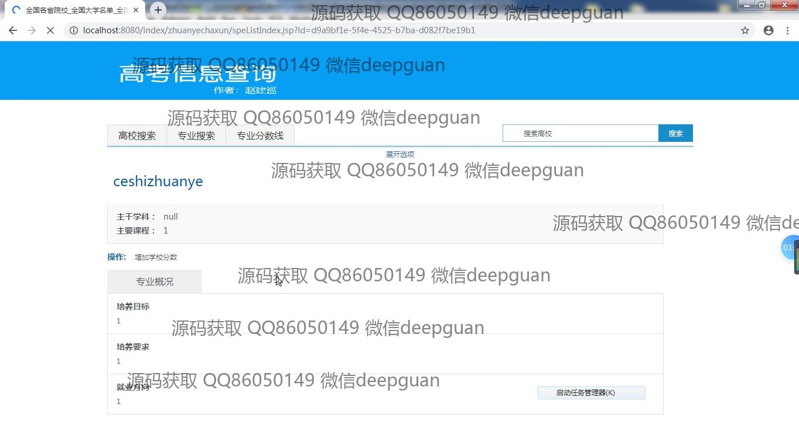
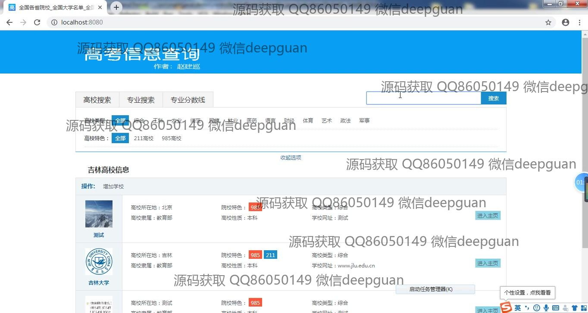
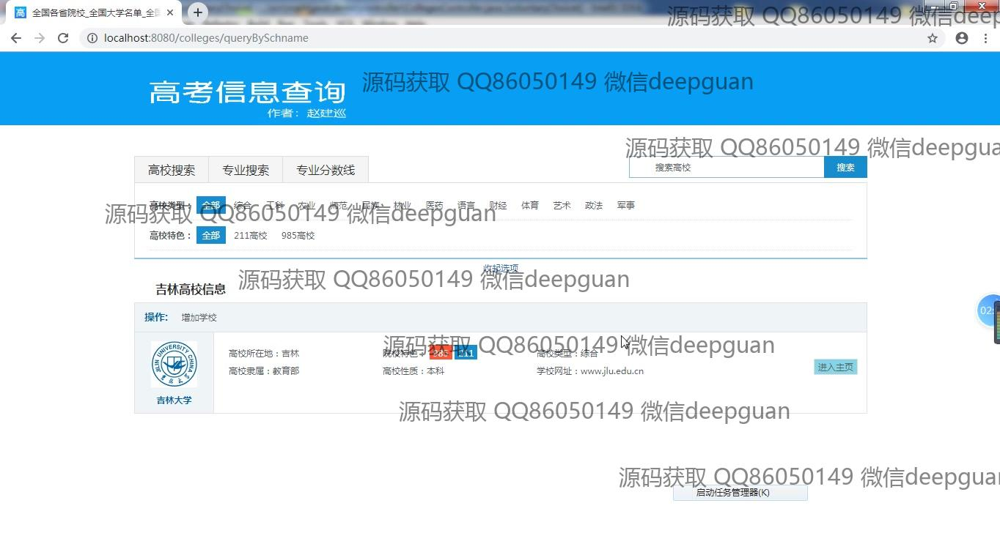

<h1 align="center">高考志愿选择辅助系统</h1>

## 简介
高考志愿选择辅助系统：提供高校搜索、专业搜索、专业分数线查询等功能，支持录取数据管理和志愿填报优化，助力考生科学选择高校和专业。    --计算机毕业设计源码；毕设源码；java毕业设计源码

## 联系方式

<h3 align="center">获取完整代码与数据库文件 + 微信：deepguan QQ: 86050149 QQ群: 783742310</h3>

<h3 align="center">可帮忙远程部署 包运行成功！提供远程部署、修改代码、设计文档指导、代码讲解等服务！</h3>

## 功能介绍（完整见运行截图）
管理员：负责用户管理和信息维护，包括添加和修改高校和专业信息，维护录取数据。为用户提供高校和专业详细信息的录入审核及后续更新。通过各种功能模块，如高校搜索、专业搜索等，确保系统信息的完整和准确。负责后台管理系统的整体运行和维护。

用户：系统提供用户注册、登录及退出功能，允许用户搜索高校和专业信息，查看及设置高考志愿。用户可以筛选高校类型、特色、专业信息等，并查看学校分数线和录取情况。用户可通过输入或选择相关条件，实现精准志愿设置和结果查询。系统还支持用户将筛选结果存储或调整，帮助用户优化高考志愿选择方案。

## 运行截图

本代码来源于网络,仅供学习参考使用!

